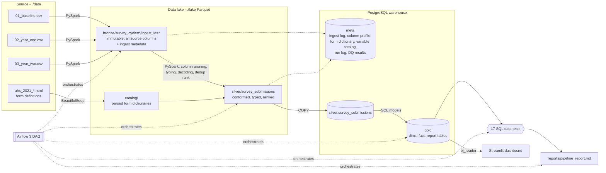
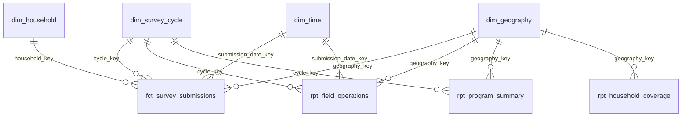

# RTV Household Survey Pipeline

End-to-end pipeline for the three-wave SurveyCTO household survey cohort (Baseline, Year 1, Year 2):
a Parquet data lake, a PostgreSQL warehouse with a dimensional Gold layer, automated data tests,
a run report and a Streamlit dashboard.

**Stack:** PySpark 4.1 · PostgreSQL 16 · Apache Airflow 3.1 · Docker Compose · Streamlit

---

## Contents

1. [Quick start](#1-quick-start)
2. [Architecture](#2-architecture)
3. [Layers and grains](#3-layers-and-grains)
4. [Household identity and deduplication](#4-household-identity-and-deduplication)
5. [Schema management across cycles](#5-schema-management-across-cycles)
6. [Warehouse model](#6-warehouse-model)
7. [Metric definitions](#7-metric-definitions)
8. [Data quality](#8-data-quality)
9. [Monitoring and observability](#9-monitoring-and-observability)
10. [Dashboard](#10-dashboard)
11. [Performance and scalability](#11-performance-and-scalability)
12. [Mapping to Databricks / Delta Lake / Unity Catalog](#12-mapping-to-databricks--delta-lake--unity-catalog)
13. [Repository layout](#13-repository-layout)

---

## 1. Quick start

**Requirements:** Docker Desktop (or Docker Engine + Compose v2) with ~6 GB RAM available. Nothing else
needs to be installed on the host.

```bash
# 1. Put the source files in ./data (they are git-ignored and never committed)
#    data/01_baseline.csv  data/02_year_one.csv  data/03_year_two.csv
#    data/ahs_2021_baseline.html  data/ahs_2021_year1.html  data/ahs_2021_year2.html

# 2. Configure secrets
cp .env.example .env          # then edit the passwords / JWT secret
                              # Linux only: set AIRFLOW_UID to the output of `id -u`

# 3. Build and start Postgres + Airflow (first build takes a few minutes)
docker compose up -d --build

# 4. Run the whole pipeline: Bronze -> Silver -> Gold -> data tests -> report
docker compose exec airflow-scheduler airflow dags test rtv_survey_pipeline

# 5. Read the run report
cat reports/pipeline_report.md
```

With `make` available the same steps are `make up`, `make run`, `make test`, `make report`.

**Database connection.** The pipeline reads its Postgres connection from five variables in `.env`:

| Variable | Default | Meaning |
|---|---|---|
| `DB_HOST` | `postgres` | Host the pipeline connects to. `postgres` is the bundled container; set a hostname to use an external Postgres instead |
| `DB_PORT` | `5432` | Port. The bundled Postgres listens on this port inside Docker and publishes it on the host |
| `DB_NAME` | `rtv_warehouse` | Warehouse database |
| `DB_USER` | `rtv` | Pipeline login (owner of the `meta`, `silver` and `gold` schemas) |
| `DB_PASSWORD` | none, required | Password for `DB_USER` |

The same variables create the bundled database on first start, so the container and the pipeline always
agree. Outside Docker (for example running `python -m rtv_pipeline` locally), set `DB_HOST=localhost`.

| Service | URL / port | Notes |
|---|---|---|
| Airflow UI | http://localhost:8080 | Local dev auth: everyone is admin. DAG `rtv_survey_pipeline` can also be triggered here |
| Warehouse | `localhost:<DB_PORT>`, db `<DB_NAME>` | Pipeline login is `DB_USER` / `DB_PASSWORD`; the dashboard uses the read-only `bi_reader` login |
| Dashboard | http://localhost:8501 | Streamlit, reads the Gold layer (see [Dashboard](#10-dashboard)) |

Unit tests run inside the container: `docker compose exec airflow-scheduler python -m pytest`.

Every step can also be run on its own, which is what the Airflow tasks call:

```bash
docker compose exec airflow-scheduler python -m rtv_pipeline bronze --cycle year1
docker compose exec airflow-scheduler python -m rtv_pipeline silver
```

To start over: `docker compose down -v` and delete the contents of `lake/` and `reports/`.

---

## 2. Architecture



**Airflow DAG `rtv_survey_pipeline`**

```
init_warehouse -> build_form_catalog -> [bronze_baseline, bronze_year1, bronze_year2]
               -> build_silver -> build_gold -> run_data_tests -> publish_report (runs even if tests fail)
```

Each task runs `python -m rtv_pipeline <step>` in its own process, so Spark gets a fresh JVM per task and
any step can be re-run by hand. Bronze runs one task per cycle in parallel (capped at 2 concurrent tasks).

### ELT, not ETL

I land the exports first and transform afterwards, inside the processing engines:

* **Load raw first.** Bronze is a byte-faithful copy of every export (verified column by column against
  the CSV) with lineage columns added. Nothing is filtered or renamed on the way in.
* **Replayable.** Silver and Gold are rebuilt from Bronze on every run. A mapping or business-rule change is
  a code change plus a re-run, not a re-ingest from SurveyCTO.
* **Schema-on-read suits changing forms.** The three exports have different columns (6,700+ in Baseline).
  Deciding what to keep at read time, through a mapping file, is simpler than maintaining a load-time
  schema for every form version.
* **Right engine per step.** Spark handles the wide part (thousands of string columns, pruned down to ~35),
  Postgres handles the narrow, relational part (joins, dimensions, aggregates) in plain SQL that analysts
  can read.

### Why these technologies

| Choice | Reason |
|---|---|
| **Parquet lake on the local filesystem** | Columnar, so Silver reads only the ~35 columns it needs out of 6,700+. Hive-style partition folders map directly to S3/ADLS/DBFS later. |
| **PySpark** | Handles very wide CSVs with quoted multi-line values reliably, and the same code runs on a cluster or Databricks unchanged. Runs in `local[*]` mode inside the Airflow worker, which is enough for this volume. |
| **PostgreSQL** | Free, well understood, works with any BI tool, transactional DDL (Gold rebuilds are atomic). Its 1,600-column limit is the reason the wide data stays in the lake and only the conformed model lands in Postgres. |
| **Airflow 3** | Dependency ordering, retries, run history and a UI out of the box. LocalExecutor keeps the stack small. |
| **Docker Compose** | One command to a working stack on a clean machine. |
| **Streamlit + Plotly** | Dashboard as plain Python in the same repo and the same `docker compose up`, so the whole solution runs from one folder with no desktop tooling; metric logic is testable code. |

---

## 3. Layers and grains

| Layer | Where | Grain | Written by |
|---|---|---|---|
| Bronze | `lake/bronze/survey_cycle=<c>/ingest_id=<sha>/` | One row per CSV record, every source column as string | `bronze.py` |
| Form catalog | `lake/catalog/form_<c>.json`, `meta.form_fields`, `meta.form_choices` | One row per form field (and per choice) | `forms.py`, `catalog.py` |
| Silver | `lake/silver/survey_submissions/`, `silver.survey_submissions` | One row per submission (duplicates kept and ranked) | `silver.py` |
| Gold | `gold.*` | See [Warehouse model](#6-warehouse-model) | `sql/gold/*.sql` |

**Bronze ingest metadata** (added to every row): `_survey_cycle`, `_source_file`, `_ingest_id`,
`_ingested_at` (UTC), `_record_seq` and `_row_hash` (SHA-256 over all source values).

**Immutability.** The partition key `ingest_id` is the first 16 hex characters of the file's SHA-256.
A partition is written to a staging folder, row counts are reconciled against an independent parse with
Python's `csv` module, and only then is it renamed into place. Re-running with the same file does nothing;
a corrected export lands next to the old one and Silver picks the newest. Nothing in Bronze is ever
overwritten.

**Column names.** Spark/Parquet cannot store names like `$1.25 / Day\r\n2005 PPP`, and the Baseline export
has both `status` and `Status`. Bronze stores a safe, case-insensitively unique name for every column and
keeps the original name, ordinal and fill rate in the partition manifest and `meta.bronze_columns`.

**A parsing detail worth knowing:** some header and answer values contain CRLF inside quotes while records
end in LF. Without an explicit `lineSep`, Spark's CSV reader auto-detects CRLF from the first quoted value
and then reads the whole file as one record. The reader pins `lineSep="\n"` with `multiLine=true`.

---

## 4. Household identity and deduplication

**Household identifier.** `hhid_2`, the tracking-sheet ID the enumerator types (and re-types as
`hhid_2_again`). Format `DIS-XXX-XXX-X0000`, for example `KAN-KAZ-YUS-K2013`, where the prefix is the
district. It is the only identifier designed to be stable across visits, so it is used both for within-cycle
dedup and for cross-cycle linkage. It is normalised (trimmed, upper-cased, inner spaces removed) into
`household_key`. Data tests check the re-typed ID matches and that 95%+ of IDs follow the pattern.

Submissions with no household ID cannot be linked; they are kept as their own unlinked household
(`UNLINKED:<KEY>`) so they still count in operational metrics, and excluded from longitudinal ones.

**Within-cycle dedup** keeps one submission per `(survey_cycle, household_key)`. Tie-breakers, in order:

1. latest `SubmissionDate` (the last version the field team uploaded),
2. latest `endtime`,
3. highest SurveyCTO `KEY`, purely to make the result deterministic.

Silver keeps every row with `dedup_rank`, `household_submission_count` and `is_latest`, so the impact of
dedup is measurable rather than hidden. Gold's fact table keeps `is_latest` rows only. In the Baseline export
this removes 5 duplicate submissions (1,419 raw to 1,414 households).

**Cross-cycle linkage** joins on `household_key` across cycles (`gold.dim_household`), giving the cycle
pattern for each household (Baseline only, Baseline + Year 1, all three, ...).

---

## 5. Schema management across cycles

* **Form dictionaries as code.** The three printable forms are parsed into field name, label, required flag,
  constraint, relevance, hint and choice list per cycle. Coded answers are decoded with **their own cycle's**
  choice list, because codes are not stable: `district = 1` is Kyenjojo in the Baseline form, Kagadi in
  Year 1 and Kisoro in Year 2.
* **Variable mapping file.** `config/variable_map.yml` declares the ~35 conformed Silver fields, their type,
  the candidate source columns (first match wins, matching exact name, then case-insensitive, then ignoring
  punctuation, so `GPS-Latitude` and `gps_latitude` both resolve), which form field decodes them, and whether
  they are required. Candidates can differ per cycle when a variable is renamed.
* **Required vs optional.** A missing required field fails the Silver step with a clear message. A missing
  optional field becomes NULL and is logged (for example `track_status` and `respondent_sex` are only in the
  Year 2 form).
* **Variable catalog.** `meta.variable_catalog` records, for every conformed field and cycle, the source
  column used, whether it was present, the form label, the choice list size and the fill rate. It is
  exported to `reports/variable_catalog.csv` on each run.
* **Drift report.** `meta.schema_drift` lists every source column and which cycles it appears in; the run
  report summarises columns shared by all cycles versus unique to one.
* **District resolution** uses the most reliable source available: the tracking-sheet preload
  (`pre_district`), then the household-ID prefix, then the decoded form choice (`district_source` records
  which). This matters: in the Baseline export the form's district codes do not match the attached form
  (see [Data quality](#8-data-quality)).

---

## 6. Warehouse model

Postgres schemas: `meta` (operational metadata), `silver`, `gold`. All Gold models are SQL files in
`sql/gold/`, rebuilt in a single transaction so the dashboard never sees a half-built model.



| Object | Grain | Content |
|---|---|---|
| `dim_survey_cycle` | one row per cycle | name, order, source file, latest ingest id, source rows/columns |
| `dim_geography` | one row per district (+ `-1` Unknown) | district name and code, sub-region, region name, region code (ISO 3166-2 `UG-W`) |
| `dim_time` | one row per day, whole months covering all submissions | year, quarter, month, ISO week, weekday flags |
| `dim_household` | one row per household across cycles | first/last cycle, cycles observed and completed, cycle pattern |
| **`fct_survey_submissions`** | **one row per household per cycle, latest submission** | status, consent flags, completion, respondent and head-of-household demographics, age band, household size, location validity, duration, number of submissions received |
| `rpt_field_operations` | cycle x submission date x district x interview status | raw / deduplicated / dropped submissions, missing location (raw and dedup), completed and timed interviews, interview minutes |
| `rpt_program_summary` | cycle x district x month x head sex x head age band | households attempted, found, consented, follow-up consented, completed, plus sums for averages |
| `rpt_cycle_comparison` | cycle x district, plus an `overall` level | completion, consent and missing-location rates and the change vs Baseline in percentage points |
| `rpt_household_coverage` | district x cycle pattern | households observed in 1, 2 or 3 cycles, Baseline-to-Year-1/Year-2 retention counts |

The report tables are additive (counts and sums only), so rates are always recomputed as
`sum(numerator) / sum(denominator)` at whatever level the dashboard filters to, never averaged.

**Geography hierarchy.** Region (Western, `UG-W`) > Sub-region (Kigezi, Ankole, Bunyoro, Tooro) > District,
from `config/geography.csv`. All districts in the forms are in Western Uganda. Sub-county, parish and village
come from the preload columns and are kept on the fact as attributes.

---

## 7. Metric definitions

All program metrics are calculated on the deduplicated fact (one row per household per cycle).

| Metric | Formula | Denominator / notes |
|---|---|---|
| Raw submissions | count of all Silver rows | every upload, including repeats |
| Deduplicated submissions | count of `is_latest` rows | = households attempted |
| Duplicate household rate | (raw - deduplicated) / raw | also shown: households with more than one submission |
| Missing location rate | submissions without a valid GPS fix / submissions | valid = lat and lon present, not (0,0), inside Uganda's bounding box; shown raw and deduplicated |
| Submissions by status | count by `status` (1 Found, 2 Moved away, 3 Not found, 4 Unavailable, 5 Disability) | codes are identical in all three forms; labels are shortened in Gold |
| Average interview duration | sum(duration min) / count, completed interviews only | excludes durations <= 0 or > 240 min (one 760-minute Baseline interview is excluded) |
| Completion rate | completed / households attempted | completed = status 1 AND `consent_1` = 1 AND `endtime` recorded |
| Consent rate | consented / households found | consent is only asked once the listed household is found, so "not found" households are excluded |
| Follow-up consent rate | `consent_2` = 1 / consented | agreement to be re-contacted for up to 5 years |
| Demographics | completed or consented households by head-of-household sex and age band | bands: Under 25, 25-34, 35-44, 45-54, 55-64, 65+, Unknown |
| Households observed in 1/2/3 cycles | count of linked households by number of cycles with a submission | longitudinal |
| Baseline to Year N retention | households completed at Baseline and in Year N / households completed at Baseline | longitudinal |
| Change vs Baseline (pp) | rate in cycle - rate at Baseline, x 100 | completion and consent |

**Where a metric is not comparable across cycles**

* **Baseline completion and consent are 100% by construction.** The Baseline export only contains
  households that were found and consented (every row has `status = 1` and `consent_1 = 1`), so it looks
  like a list of completed interviews rather than all attempts. Changes vs Baseline therefore show how much
  lower follow-up rates are, not a like-for-like trend. Year 1 vs Year 2 is the fair comparison.
* **Respondent sex** and **track status** (Target/Reserve) are only asked in the Year 2 form, so
  replacement households cannot be identified in earlier cycles.
* **Education level** codes changed between forms (Year 2 adds Pre-primary `22`, Doctorate `20` and
  Not applicable `-99`), so Silver keeps each cycle's own label and no cross-cycle education metric is
  published.
* **Income/consumption per adult equivalent** is a derived column appended to the export rather than a
  form question. It is carried in the fact where present (NULL otherwise) but not used as a longitudinal
  metric, because the derivation may differ between cycles.

---

## 8. Data quality

### Automated tests

17 SQL tests in `sql/tests/` run after every Gold build (`dbt`-style: each query returns violating rows,
zero rows = pass). Results are stored in `meta.dq_results` and listed in the run report. Any failing
**error** test fails the DAG; **warn** tests are reported but do not block. The report task runs either way.

| # | Test | Severity | Layer |
|---|---|---|---|
| 01 | Source CSV record count = Bronze row count | error | bronze |
| 02 | Silver row count = Bronze row count per cycle | error | silver |
| 03 | SurveyCTO `KEY` unique within a cycle | error | silver |
| 04 | Submission key, timestamp and status populated | error | silver |
| 05 | Status in 1-5, consent in 0/1 | error | silver |
| 06 | Fact grain unique (household, cycle) | error | gold |
| 07 | Fact rows = distinct households in Silver | error | gold |
| 08 | Fact rows join to all dimensions | error | gold |
| 09 | Consent only recorded when household found | warn | silver |
| 10 | Re-typed household ID matches | warn | silver |
| 11 | >= 95% of household IDs follow the pattern | warn | silver |
| 12 | Every household placed in a known district | warn | gold |
| 13 | Form district code agrees with tracking-sheet district | warn | silver |
| 14 | Head age between 13 and 120 | warn | silver |
| 15 | start <= end <= upload, dates plausible | warn | silver |
| 16 | <= 2% of completed interviews with implausible duration | warn | gold |
| 17 | Missing location below 10% per cycle | warn | gold |

There are also 37 unit tests (`tests/`, pytest + local Spark) covering the form parser, column naming,
CSV edge cases (quoted CRLF), immutable re-ingest, source-column resolution, timestamp formats, dedup
tie-breakers, district precedence and GPS validation, the SQL template/test metadata, and the dashboard metric formulas.

### Profiling

* Fill rate of every Bronze column per cycle (`meta.bronze_columns`), read from Parquet footer statistics,
  so profiling 6,700 columns costs no extra scan.
* Fill rate of every conformed field per cycle in `meta.variable_catalog`.

### Findings on the Baseline export

| Finding | Detail | Handling |
|---|---|---|
| Duplicate submissions | 5 households submitted twice (10 rows) | latest submission kept; dedup impact reported |
| District codes do not match the attached Baseline form | export codes 1/2/4 are Rukungiri/Kanungu/Mitooma (from `pre_district` and the ID prefix); the attached form lists 1 = Kyenjojo, 2 = Kagadi and has no code 4. 964 submissions conflict, 455 cannot be decoded | district taken from the preload; flagged by test 13 |
| Pre-filtered export | all 1,419 rows are status 1 and consented | documented in metric definitions |
| Upload before interview start | 1 submission received before its `starttime` (device clock) | flagged by test 15, kept |
| Duration outlier | 1 interview of ~760 minutes (form left open) | excluded from average duration |
| Header with embedded line break | `$1.25 / Day\r\n2005 PPP` | handled by the reader; original name kept |

---

## 9. Monitoring and observability

* **`meta.pipeline_run_log`**: one row per step per run with status, start/end, duration, rows in/out,
  JSON details (ingest id, rows per cycle, missing optional fields, failed tests) and the error message on
  failure.
* **`meta.ingest_log`**: every ingested file with SHA-256, size, source rows, Bronze rows and columns.
* **Row counts per cycle per layer** (source -> Bronze -> Silver -> Gold) and the dedup reconciliation are
  in the run report and enforced by tests 01, 02 and 07.
* **Error handling**: required-field and file-missing checks fail fast with clear messages; a failed Bronze
  parse never leaves a partial partition; Airflow retries each task once (except the tests);
  `publish_report` runs even if tests fail so there is always a report of what went wrong.
* **Outputs per run** in `reports/`: `pipeline_report.md`, `data_tests.csv`, `row_counts.csv`,
  `cycle_comparison.csv`, `variable_catalog.csv`.

---

## 10. Dashboard

Streamlit app in `dashboard/`, started by Docker Compose with the rest of the stack.

**Open it:** run the pipeline, then go to http://localhost:8501 (`DASHBOARD_HOST_PORT` in `.env`). If the
pipeline ran after the page was opened, use **Reload data** in the sidebar (data is cached for 5 minutes).

It connects as the read-only `bi_reader` login, which can only read the `gold` schema and the three
run-health tables in `meta`. All metric logic is in `dashboard/metrics.py` (unit-tested in
`tests/test_dashboard_metrics.py`); every rate is computed as a ratio of sums at the level shown.

**Filters (sidebar):** survey cycle and district. Longitudinal views compare cycles, so they follow the
district filter only.

| Tab | What it answers |
|---|---|
| Field Operations | Raw vs deduplicated submissions, duplicate rate, missing location rate, average interview duration; weekly submission volumes per cycle; interview status mix; dedup impact chart and table; missing location before and after dedup; duration per cycle |
| Program Summary | Households attempted, completion, consent and follow-up consent rates, household size; completion and consent rate by district and cycle; completions by district and month; completed or consented households by head-of-household age band and sex; demographic profile; cycle comparison with change vs Baseline |
| Longitudinal | Households observed, share seen in all three cycles, Baseline-to-Year-1 and Year-2 retention, households by cycle pattern, change in completion and consent from Baseline to Year 2 by district, rates across cycles |
| Pipeline Health | Row counts source -> Bronze -> Silver -> Gold per cycle, latest data-test results, latest run steps |
| Metric Definitions | Formula and denominator for every metric (`dashboard/metric_definitions.md`) |

To run it outside Docker: `pip install -r dashboard/requirements.txt`, set `DB_HOST=localhost`,
`DB_USER=bi_reader`, `DB_PASSWORD=<BI_READER_PASSWORD>`, then `streamlit run dashboard/app.py`.

---|---|
| Field Operations | Raw vs deduplicated submissions, duplicate rate, missing location rate, average interview duration; monthly submission volumes by cycle; interview status mix; dedup impact table; missing location before and after dedup |
| Program Summary | Households, completion, consent and follow-up consent rates; completion and consent by district and cycle; completed interviews by month; completed and consented households by head-of-household age band and sex; cycle comparison with change vs Baseline |
| Longitudinal | Households observed, share seen in all three cycles, Baseline-to-Year-1 and Year-2 retention, households by cycle pattern, change in completion and consent from Baseline to Year 2 by district, rates across cycles |

Each page has survey cycle and district slicers (district only on Longitudinal).

---

## 11. Performance and scalability

* **Column pruning**: Bronze is columnar Parquet; Silver selects ~35 of up to 6,700+ columns, so Spark reads
  a fraction of the data.
* **Partitioning**: Bronze by `survey_cycle` and `ingest_id`, Silver by `survey_cycle`. A new cycle or a
  corrected export only adds a partition.
* **Cheap profiling**: column fill rates come from Parquet footer statistics instead of a 6,700-column
  aggregation (this took Bronze for Baseline from ~85 s to ~45 s).
* **Bulk loads**: Silver is loaded into Postgres with `COPY`, not row inserts.
* **Indexes**: the fact has a unique index on (household, cycle) and indexes on each dimension key;
  Silver is indexed on household and submission key; tables are `ANALYZE`d after each build.
* **Pre-aggregated report tables** keep the dashboard light: it reads aggregates plus one narrow fact
  (one row per household per cycle) and caches them for 5 minutes.
* **Run time**: a full three-cycle run takes a couple of minutes locally, most of it JVM start-up and
  writing the widest Bronze partition.

**Scaling further.** The same code runs on a Spark cluster by changing `SPARK_MASTER`. At much larger volume
I would: move the lake to object storage (S3/ADLS/MinIO), switch Silver to Delta for MERGE-based
incremental loads instead of full rebuilds, load Postgres with JDBC in parallel partitions, and make the
Gold models incremental by cycle. Postgres would stay fine for the Gold layer well into tens of millions of
fact rows; beyond that a columnar warehouse (Databricks SQL, BigQuery, Snowflake) is the natural next step.

---

## 12. Mapping to Databricks / Delta Lake / Unity Catalog

| This repo | Databricks |
|---|---|
| `lake/bronze` Parquet partitions | Delta table `rtv.bronze.ahs_<cycle>` (or one table partitioned by cycle), loaded with Auto Loader from a Unity Catalog **volume**; `ingest_id`/`_row_hash` kept as columns; Delta history and table constraints give immutability guarantees |
| Column-name sanitising | Delta column mapping mode (`delta.columnMapping.mode = name`) keeps the original names directly |
| `silver.py` (PySpark) | Same code as a notebook or job task writing `rtv.silver.survey_submissions`; dedup via `MERGE` on (cycle, household) |
| `sql/gold/*.sql` | Databricks SQL / Lakeflow declarative pipelines materialised views in `rtv.gold` |
| `sql/tests/*.sql` | Delta Live Tables expectations or SQL alerts; results to a `rtv.meta` table |
| `meta.variable_catalog`, form dictionary | Unity Catalog table and column comments + tags, lineage captured automatically |
| Airflow DAG | Databricks Workflows (Jobs) with the same task graph, or Airflow's Databricks provider |
| `bi_reader` role | Unity Catalog `GRANT SELECT ON SCHEMA rtv.gold TO bi_readers`; the dashboard connects through the Databricks SQL connector / SQL warehouse |

---

## 13. Repository layout

```
.
├── config/
│   ├── pipeline.yml          # cycles, paths, Spark settings, business rules
│   ├── variable_map.yml      # conformed Silver schema and source columns per cycle
│   └── geography.csv         # district -> sub-region -> region reference
├── dags/rtv_survey_pipeline.py
├── src/rtv_pipeline/
│   ├── __main__.py           # CLI: init | catalog | bronze | silver | gold | test | report | all
│   ├── forms.py              # SurveyCTO form HTML parser
│   ├── catalog.py            # form dictionary + reference data to the warehouse
│   ├── bronze.py             # immutable lake ingest
│   ├── silver.py             # conformance, decoding, dedup ranking, variable catalog
│   ├── gold.py               # runs sql/gold in one transaction
│   ├── quality.py            # runs sql/tests
│   ├── report.py             # run report and CSV extracts
│   ├── warehouse.py          # Postgres helpers, COPY loads, run log
│   ├── sqlrunner.py          # {{ rule }} templating for SQL files
│   ├── settings.py
│   └── spark.py
├── sql/
│   ├── warehouse/            # schemas, metadata and Silver DDL
│   ├── gold/                 # dimensional model and report tables
│   └── tests/                # data tests
├── tests/                    # pytest unit tests
├── dashboard/                # Streamlit app (app.py, metrics.py, data.py)
├── docker/                   # Airflow image, Postgres init
├── data/                     # source files (git-ignored)
├── lake/                     # generated lake (git-ignored)
├── reports/                  # generated run reports (git-ignored)
├── docker-compose.yml
├── Makefile
├── README.md
└── SUBMISSION.md
```
